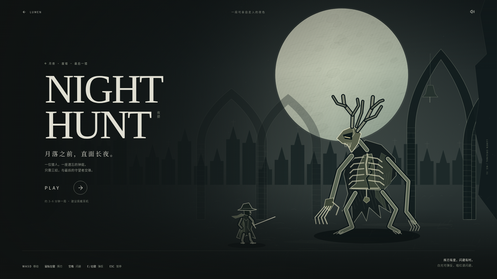
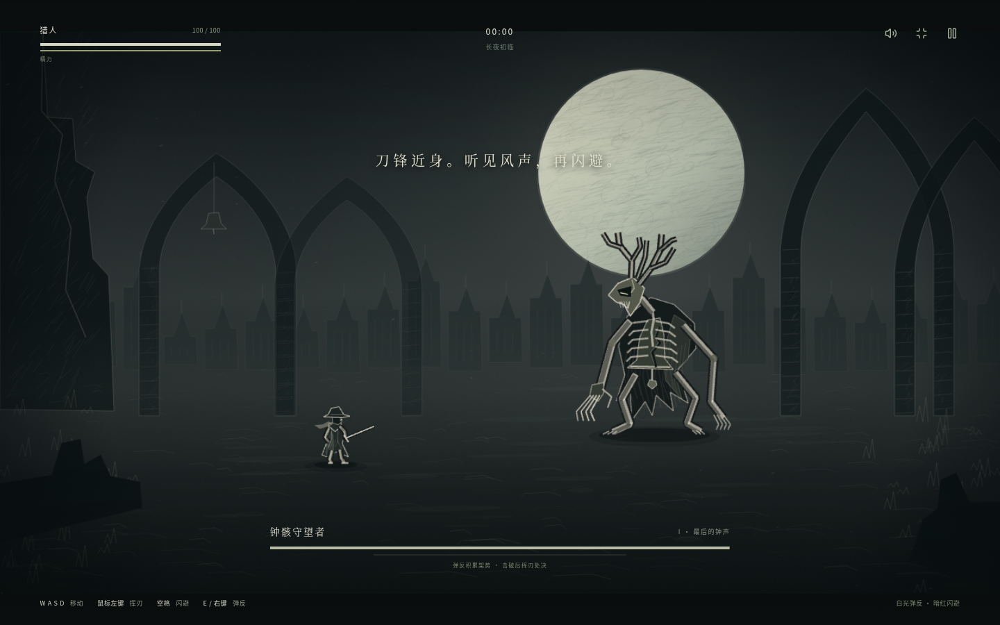

# LUMEN — Personal Game Library

A little space for the worlds you love. A cinematic, local-first game archive with an original photographic identity, warm editorial typography, and quiet motion.


## Run

Use Node **24** (tested with 24.19.0) and npm. No API keys, database, environment variables, or remote artwork service are required.

```bash
npm ci
npm run dev -- --host 0.0.0.0
```

```bash
npm run build     # TypeScript check followed by production build
npm run preview   # Serve the production output locally
```

`codex-cloud-setup.sh` installs from the committed lockfile and builds from the repository directory. Dependencies are pinned. `src/vite-env.d.ts` includes the Vite asset declarations required by TypeScript.

## The experience

- **Discover** — full-screen photography, three selectable featured worlds with crossfades, scroll-linked depth, recently played and favorite rails, curated collections, and editorial storytelling.
- **Library** — all 20 games, text search, favorites, genre/platform/status/collection filters, and sorting by recent activity, title, personal score, playtime, or release year. Collection links and favorite views have shareable hash routes.
- **Game detail** — cinematic artwork, metadata, editable status, personal score, playtime, first/last-played and completion dates, notes, and collections. The gallery opens a navigable lightbox.
- **Timeline** — personal history grouped by the year first played, with undated entries kept visible. Quiet image movement follows scrolling.
- **Statistics** — live totals, finished stories, favorites, average score, platform and genre breakdowns, score ranges, and release years. All figures derive from the same editable archive.
- **TV mode** — a focused, full-window experience with large imagery, a directional cover rail, an optional browser fullscreen control, and standard-mapped gamepad support.
- **NIGHT HUNT / 夜猎** — an original playable short at `#/night-hunt`: an illustrated full-screen cover, one two-phase boss, stamina, perfect dodges, timed parries and posture breaks. Phaser 3 draws an original charcoal-and-chalk arena; Web Audio synthesizes the score and combat sound. The engine loads only after **PLAY**.

Every default photograph is bundled locally. The demo uses atmospheric photographs and original typographic covers, **not official game screenshots**. The detail gallery labels this clearly. See [artwork sources and licensing](docs/ARTWORK.md).

## NIGHT HUNT · 夜猎

[直接游玩](https://gongsheng16435.github.io/qiantai/#/night-hunt)。也可以从首页的 **NIGHT HUNT → PLAY** 封面或导航「夜猎」进入。

WASD / 方向键移动，鼠标左键挥刃（可按住连击），空格闪避，E / 鼠标右键弹反，Escape 暂停。鼠标决定朝向；触控提供移动摇杆和三枚招式按钮，建议横屏。白色预警可以弹反，暗红重砸与冲击波需要闪避。完美防御回复少量生命与精力，弹反积累架势，击破后近身挥刃可处决。Boss 半血进入月蚀阶段，场景、连招、粒子和音乐一起变化。

单局按约 3–6 分钟的谨慎进攻节奏设计，熟练玩家可更快通关；倒下 0.95 秒后自动重开。页面提供静音、暂停、全屏、重开和结算；浏览器不允许原生全屏时仍以窗口全屏运行。切出窗口自动暂停，减少动态效果偏好会关闭震屏、强闪光和装饰性运动。





美术和音乐均由本项目绘制 / 合成，不下载其他游戏的角色、场景或音轨；不需要 API、登录或额外资源服务。详见 [机制、架构与验证记录](docs/NIGHT_HUNT.md)。


<details>
<summary>Mobile view</summary>

</details>

## 中文界面

页面统一使用简体中文，导航、筛选、状态、表单和提示以清楚易懂为先，首页与时间线的叙事保留轻微诗意，例如「去过的远方，仍在心上」。中文标题采用适合阅读的字距、行高与宋体衬线，桌面和手机布局均已适配。

游戏显示中文名称，同时支持英文原名搜索。日期按中文习惯显示，名称排序使用中文拼音顺序。状态与默认合集仍保留原有内部标识，已有本地记录和合集链接继续有效；用户自己填写的笔记和合集名称不会被翻译或覆盖。编辑合集时，中英文逗号均可分隔。

## Controls and accessibility

| Control                    | Behavior                                                |
| -------------------------- | ------------------------------------------------------- |
| Cmd/Ctrl + K               | Open or close global search                             |
| Up / Down in search        | Select a result                                         |
| Enter in search            | Open the selected game                                  |
| Left / Right on a cover    | Move between covers                                     |
| Home / End on a cover      | First / last cover in the rail                          |
| Enter on a cover           | Open game detail                                        |
| Escape                     | Close the current dialog; return from detail or TV mode |
| Up / Down in TV mode       | Move between the selected game action and the rail      |
| Gamepad D-pad / left stick | Browse in TV mode                                       |
| Gamepad A / B              | Open game / leave TV mode                               |

The interface includes a skip link, visible focus indicators, semantic form controls, modal focus containment and restoration, live save feedback, and `prefers-reduced-motion` support. Reduced motion removes parallax, entrance movement, crossfade timing, and smooth scrolling. Fullscreen depends on the browser allowing it; the full-window TV layout remains usable without it. Gamepad hardware was not available for physical-device validation.

## Personal data

Changes are stored under **`lumen.archive.v1` in localStorage**, scoped to the browser and site origin. Favorites, notes, collections, scores, hours, statuses, and dates survive reloads. There is no sign-in, tracking, backend, or cloud sync. Browser private mode or storage restrictions may prevent persistence; the UI reports that situation. Clearing this key restores the bundled demo archive. Moving from a local server to GitHub Pages creates a separate archive because the origin changes.

The initial collection and personal dates are illustrative demo data. Editing them updates the Library, Timeline, and Statistics views immediately.

## Structure

```text
src/
  App.tsx                 Hash routing, navigation, search shortcut, save feedback
  components/
    ui.tsx                Artwork fallback, covers, rails, reveal, accessible modal
    Search.tsx            Keyboard-navigable command search
  pages/
    Home.tsx              Discover and editorial collections
    Library.tsx           Search, filters, sorting, favorites
    Detail.tsx            Personal record editor and gallery
    Timeline.tsx          History grouped by personal dates
    Statistics.tsx        Archive-derived consumer statistics
    TV.tsx                Directional navigation and fullscreen
    NightHunt.tsx         Standalone game cover, HUD, pause/results, touch controls
  night-hunt/
    createGame.ts         Lazy Phaser 3 boot and canvas scaling
    NightHuntScene.ts     Encounter, input, combat, particles, lifecycle
    renderer.ts           Original procedural line-art and two-phase environment
    audio.ts              Web Audio music and synthesized sound effects
    types.ts              Small renderer / scene / React contracts
    night-hunt.css        Full-screen game interface and responsive styles
  data/games.ts           Typed 20-game demo dataset
  lib/archive.ts          Local persistence, field normalization, routing helpers
  lib/providers.ts        Local / Steam / RAWG / IGDB artwork adapters
  styles/global.css       Visual system, responsive layouts, reduced motion
public/
  artwork/                Bundled photographs
  games/manifest.json     Optional per-game artwork overrides
  night-hunt/cover.svg     Original local illustration
```

React + TypeScript + Vite, Framer Motion, and Lucide icons. Pages are loaded lazily. Routing uses `#/library`, `#/game/journey`, etc., so GitHub Pages deep links need no server rewrite. Vite uses a relative asset base, including when deployed below `/qiantai/`.

## Replace the artwork

Put authorized images under `public/games/<id>/`, then edit `public/games/manifest.json`:

```json
{
  "journey": {
    "hero": "games/journey/hero.jpg",
    "cover": "games/journey/cover.jpg",
    "screenshots": ["games/journey/scene-1.jpg", "games/journey/scene-2.jpg"]
  }
}
```

Paths are relative to the deployed site, so the same manifest works locally and on GitHub Pages. HTTPS image URLs are also accepted. Missing or failed images use a bundled local fallback. Omitted fields retain the default artwork. The manifest is loaded at startup.

`steamProvider(endpoint)`, `rawgProvider(endpoint)`, and `igdbProvider(endpoint)` expose an `ArtworkProvider.resolve(id, signal)` interface. They normalize provider-shaped responses from a **same-origin gateway**, requested with `?id=...`. Steam accepts its `appdetails` response, RAWG accepts a game response with `short_screenshots` or `screenshots`, and IGDB accepts its game response with expanded cover/artwork/screenshot `image_id` values. Keep API credentials in that future gateway, never in this client or a public environment variable. The static demo only invokes the local provider; live third-party integrations are extension points and have not been validated against credentialed services.

## GitHub Pages

The workflow in [`.github/workflows/pages.yml`](.github/workflows/pages.yml) installs with `npm ci`, builds, uploads `dist`, and deploys through GitHub's official Pages actions. It runs on pushes to `main` or a manual **Run workflow**.

1. In the repository's **Settings → Pages**, select **GitHub Actions** as the build/deployment source. Repository admin access may be required for this initial setting.
2. Push the finished source to `main`, or run **Deploy LUMEN to GitHub Pages** from Actions after the workflow reaches the default branch.
3. Wait for the deployment job to succeed. Its `github-pages` environment contains the confirmed deployment URL.

**Live site: https://gongsheng16435.github.io/qiantai/**. Pages is enabled and [deployment run 37234920696](https://github.com/gongsheng16435/qiantai/actions/runs/37234920696) succeeded. The published site's desktop/mobile navigation, search, game detail, deep links, and local images were verified in Chromium with TLS verification enabled. See [deployment status](docs/DEPLOYMENT.md) for details.

## Validation performed

- Frozen install (`npm ci`) and `npm run build`: passed.
- Chromium interactions: featured-artwork switching; Cmd/Ctrl+K and Enter search; editing then reloading notes, status, hours and score; favorites; all filter types and sorting; empty results; gallery open/close; cover arrows; TV arrows, Enter and Escape; mobile navigation; reduced motion.
- All six routes inspected at **1440×900, 1920×1080, and 390×844**, with no broken local images or document horizontal overflow.
- The built output was served under **`/qiantai/`** and the functional checks repeated, including direct hash-route loads. No browser JavaScript errors were recorded.
- Live Pages deployment and browser smoke checks: passed. Physical gamepad hardware and credentialed provider APIs remain untested.
